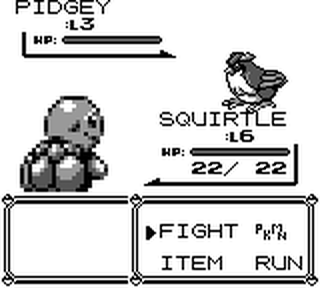

# LMM_Pokemon with LLaVA Engine

## Overview

This project aims to integrate the LLaVA language vision model into a Game Boy emulator (PyBoy) to play Pokemon games. The LLaVA model analyses the game's current state and suggests actions like moving UP, DOWN, LEFT, RIGHT, or pressing A, B, SELECT, START buttons.


## Requirements

- Python >= 3.9
- PyBoy
- LLaVA model files

## Installation

1. Clone the repository.
2. Install the requirements.
3. Download and place the LLaVA model files in the appropriate directory.

## How to Run

```bash
python main.py
```

This will start the PyBoy emulator and the LLaVA model will start interacting with it.

## Features
### Multi-threading
The step_function is run in a separate thread to continuously capture the screen and ask the LLaVA model for the next action.

### Dynamic Actions
The LLaVA model analyses the current screen and provides actions dynamically.

### Keyboard Simulation
The PyBoy emulator receives programmatic keyboard input based on the LLaVA model's suggestions.

## Troubleshooting
If you encounter any issues related to the LLaVA model not getting the proper images or not suggesting proper actions, please check the following:

- Ensure that the image is being passed in the correct format to the LLaVA model.
- Make sure that the LLaVA model is properly initialized and loaded.

## Contributing
Feel free to open issues and pull requests!

